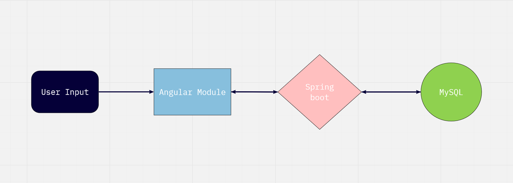

# IMPORTANT

This repo only contains the backend portion of the app. 
To see the front-end, please go to this link [olympic-trials-client](https://github.com/AllergictoCrustaceans/olympic-trials-client).

This project was meant to help me (AllergictoCrustaceans) learn how to build a full-stack app with an OOP mindset.
As I learn more, I will add more features to this project. 
*What features you ask? Some are listed at the bottom of this markdown :D*

## What is olympic-trials about?

olympic-trials is a full-stack web app for Olympic-trial-qualifiers to register themselves for the Olympic Trials for a chance to be placed in the USA Olympic team.
The intent of this app is not meant to solve any political/economic/social issue.

The languages and frameworks used to create this app are:
- Java
- Typescript
- Spring Boot
- Angular 9
- MySQL

## Can I see a demo?

## What are its features?
*Not currently deployed*

- CRUD operations 
- Authentication/Authorization via Spring Security (future)
- Show athletes' olympic trial events (future)
- Show athletes' past events (future)
- Other sports (future)

## What's the flow of the app?

We have a model entity called Athlete.java, which is connected to our local mySQL.

We have CRUD operations defined with endpoints on the backend (controller.java).

We also have our angular modules associated to our CRUD operations defined on the frontend (e.g. create-athlete.component.ts).

When the user inputs information and/or clicks on a button from Angular UI, this calls on a frontend Angular module that corresponds to performing that respective crud operation.
This then invokes the backend script Controller.java, to find which endpoint is associated to which CRUD operation, and send user input/command back to mySQL for retrieving/inputting data. 

